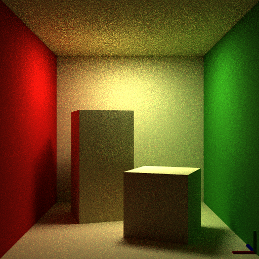

# CG3 Path Tracer

This is a backup / source opening of a old project (December 2014).

It is a scolar unoptimized path tracer.



I expect to find some time to port this code to Rust to lear this langage soon™.

# Licence

```
"THE BEER-WARE LICENSE" (Revision 42):

Tycho Tatitscheff wrote this project from a base from Dresdner Univerity CG3 course. 
As long as you retain this notice you can do whatever you want with this stuff. 
If we meet some day, and you think this stuff is worth it, you can buy me a beer 
in return.
```
